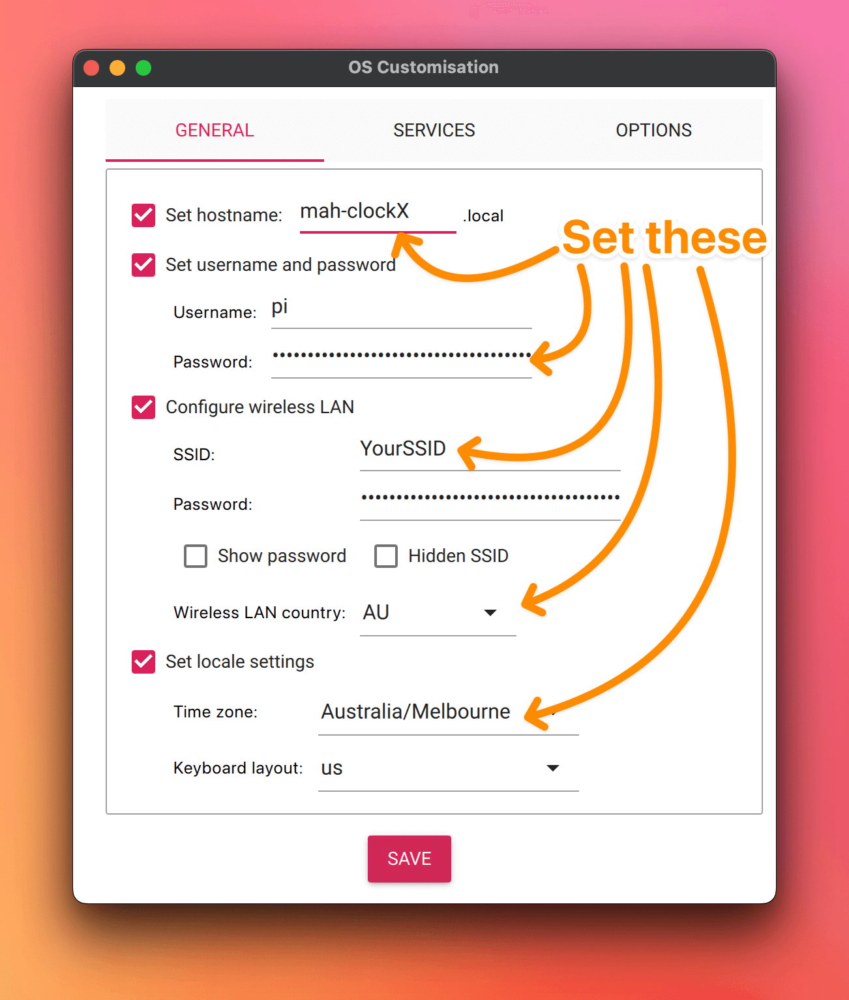
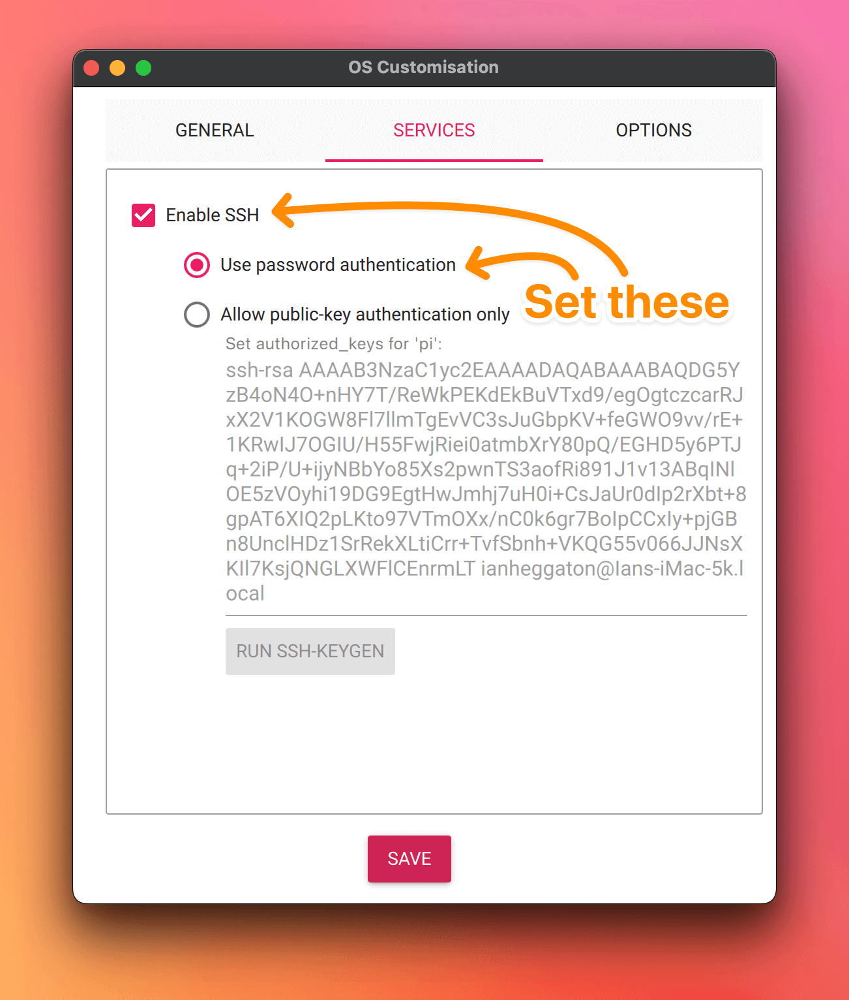

# Pi-XClock Configuration

A simple clock for the Raspberry Pi utilising Raspberry Pi, X-11 and X-Clock.

These instructions are specific for a defined use case. _YMMV_.

## 1. Install Raspbian \*_Bullseye_\* on the Raspberry Pi, configure it as follows:

- Image: `Raspberry Pi OS (Legacy, 64-bit) Lite`
- Then customize the settings as follows:
    - **General**
        - Hostname: `mah-clock[1]` <- where the number is a unique identifier
        - User: `pi`
        - Password: `[set this]` <- this should be predefined
        - Wireless LAN: Connect to your Wi-Fi network
            - Set the LAN country to `AU`
        - Timezone: `Australia/Melbourne`
        - Keyboard: `us`

      [](./README_ASSETS/Pi-settings-1_general.png)

    - **Services**
        - SSH: Enable
        - Enable `Use password authentication`

      [](./README_ASSETS/Pi-settings-2_services.png)

## 2. Log into the Raspberry Pi via SSH

- If you haven't already, hook the raspberry pi to power and let it boot up. _It may reboot a few times_ on the first
  run whilst it self-configures.
- Then log in:
  ```bash
  ssh pi@mah-clock[X].local
  ````

## 3. Install the following packages:

```bash
sudo apt update && sudo apt install xorg xserver-xorg xinit x11-apps unclutter -y
```

## 4. Configure the X-Server

- In the home directory of the `pi` user, create a `.xserverrc` file with the following contents:
  ```bash
  nano ~/.xserverrc
  ```
  ```shell
  #!/bin/sh
  #Start an X server with power management disabled so that the screen never goes blank.
  exec /usr/bin/X -s 0 -dpms -nolisten tcp "$@"
  ```

## 5. Configure the X-Session

- In the home directory of the `pi` user, create a `.xsession` file with the following contents:
  ```bash
  nano ~/.xsession
  ```
- Add the following contents:
  ```shell
  #!/bin/sh
  #This tells X server to start XClock at startup
  xclock -digital
  ```

## 6. Add the `pi` user to the `tty` group

```bash
sudo usermod -a -G tty pi
```

## 7. Configure the X-Resources

- Still in the home directory of `pi`, edit `.Xresources`:
  ```bash
  nano ~/.Xresources
  ```
  ```text
  XClock*foreground: #FFFFFF
  XClock*background: #000000
  XClock*strftime: %T
  XClock*update: 1
  XClock*geometry: 1800x900+100+300
  XClock*padding: 0
  XClock*face: Ubuntu Sans Mono :pixelsize=380 :weight=medium
  XClock*analog: false
  ```

## 8. Install the `ubuntu.ttf` font into the `~/.fonts` directory

You can install a font either by copying it from your local machine, or by downloading it from Google Fonts.

### Option 1: Copy the font from your local machine

- On the raspberry pi, create the directory for the font
  ```bash
  mkdir ~/.fonts
  ```
- Download the `ubuntu.ttf` font from this repository
- On your local machine, open a new terminal and navigate to the folder that contains this (README.md) file
- Copy the `ubuntu.ttf` font into the raspberry pi's `~/.fonts` directory using `scp`:
  ```bash
  scp ./ubuntu.ttf pi@mah-clock[X].local:~/.fonts
  ```

### Option 2: Download the font from Google Fonts

- Make the directory for the font

  ```bash
  mkdir ~/.fonts
  cd ~/.fonts
  ```

- Download the font from Google Fonts

  ```bash
  wget -O ubuntu.ttf https://github.com/google/fonts/raw/main/ufl/ubuntusansmono/UbuntuSansMono%5Bwght%5D.ttf
  ```
- Then navigate back home
  ```bash
  cd ~
  ```

## 9. Configure the `Xwrapper.config` file

- Edit `/etc/X11/Xwrapper.config`:

  ```bash
  sudo nano /etc/X11/Xwrapper.config
  ```

- Change the `allowed_users` value to `anybody`

  ```text
  allowed_users=anybody
  ```

- Add a new line at the bottom of the file

  ```text
  needs_root_rights=yes
  ```
- The end of your file should now look like this:
  ```text
  allowed_users=anybody
  needs_root_rights=yes
  ```

## 10. Create a runnable clock service.d unit file

- Create a `clock.service` file in `/etc/systemd/system`:

  ```bash
  sudo nano /etc/systemd/system/clock.service
  ```

- Add the following contents:

  ```text
  [Unit]
  Description=Clock
  After=network-online.target
  DefaultDependencies=no
  
  [Service]
  User=pi
  ExecStart=/usr/bin/startx
  Restart=always
  RestartSec=10
  
  [Install]
  WantedBy=multi-user.target
  ```

## 11. Enable the clock service

- Enable the clock service

  ```bash
  sudo systemctl enable clock
  ```

## 12. Start the clock service

- To start the clock service, reboot the Raspberry Pi

  ```bash
  sudo reboot
  ```

## 13. Other

## Install Script

Run as the `pi' user as commands that need root are call with `sudo`

```bash
# run remotely
ssh pi@ip_of_your_pi 'bash -s' < install.sh [newhostname]
# eg
ssh pi@10.197.3.180 'bash -s' < install.sh pi-clock2

# run locally 
./install.sh [newhostname]
```


### Debugging

If the clock does not start, log into the Raspberry Pi via SSH and check the logs:

``` bash
sudo systemctl status clock
```

If that doesn't reveal anything, try:

```bash
sudo journalctl -u clock
```

Whilst debugging, you can restart the clock service without rebooting the Raspberry Pi:

```bash
sudo systemctl restart clock
```

### "Accessing" the clock

If you need to access the clock display (ie monitor) from the shell, you first need to export the display:

```bash
export DISPLAY=:0
```

Then you should be able to manipulate the clock or configure it using `xrdb`. For example, if the clock isn't
displaying as expected, you may need to use `xrdb` to merge the `.Xresources` file into the X-11.

```bash
xrdb -merge ~/.Xresources && xclock &
```

### NTP Date/Time Synchronisation

Being that this entire project is a clock, it is important to have the clock synchronised with the internet time.
Especially because there is no battery backup for the Raspberry Pi. As such, it's important to ensure the clock is
synchronised and accurate.

The pi should already have the built-in synchronisation tools installed. To verify this, run the following command to
see (amongst other things) when the last synchronisation took place:

```bash
timedatectl
```

If you want to see the data associated with the last synchronisation, run the following command:

```bash
timedatectl show-timesync
```

And:

```bash
timedatectl timesync-status
```
